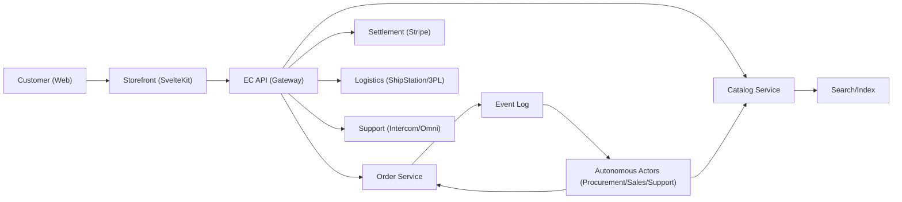

# etzhayyim-project-ec: Ecommerce Design

Scope: a global storefront that can run standalone (own domain) while integrating with marketplaces and autonomous actors for procurement, listings, fulfillment, settlement, and support.

## Non-Goals

- Rebuilding a full ERP in the first iteration.
- Tight coupling to any single commerce provider (Shopify, custom, marketplaces).

## User Journeys (MVP)

1. Browse and search catalog, view PDP (product detail page).
2. Add to cart, checkout, pay.
3. Order confirmation, shipping updates, self-serve support.
4. Admin: create/update listings, pricing rules, inventory, fulfillment routing, refunds/returns.

## Domain Model (Core)

- `Product`: canonical catalog entity (title, description, media, attributes, brand).
- `Offer`: sellable unit for a product (price, currency, condition, channel, availability).
- `InventoryItem`: stock record (location, quantity, reserved, inbound).
- `Cart`: customer intent (items, pricing snapshot, taxes/shipping estimate).
- `Order`: immutable commercial record (items, totals, customer, shipment, payment).
- `PaymentIntent`: authorization/capture lifecycle (provider id, status, risk score).
- `Shipment`: fulfillment record (carrier, tracking, labels, events).
- `Return`: reverse logistics (RMA, reason, inspection, refund decision).
- `SupportTicket`: customer comms (channel, status, linked order).

## Key Invariants

- Orders are append-only in critical fields; changes are modeled as events (refunds, replacements, cancellations).
- Pricing shown to user is snapshotted at checkout; later catalog changes do not rewrite the order.
- Inventory reservations are explicit and time-bounded.
- Every external integration uses idempotency keys.

## Architecture (Logical)

Implementation notes:

- Keep the storefront thin; business logic lives behind the API boundary.
- Prefer XRPC or MCP-style tooling for actor capabilities (internal), but expose stable REST/JSON for the public storefront if needed.

## Data Interfaces (API Sketch)

Public:

- `GET /catalog/search?q=&filters=`
- `GET /catalog/products/:id`
- `POST /cart` / `POST /cart/items`
- `POST /checkout` (creates `PaymentIntent`, calculates totals)
- `POST /orders/confirm` (finalize after payment)
- `GET /orders/:id` (auth required)
- `POST /support/tickets`

Admin (authz required):

- `POST /admin/products` / `PATCH /admin/products/:id`
- `POST /admin/offers` / `PATCH /admin/offers/:id`
- `POST /admin/inventory/adjust`
- `POST /admin/orders/:id/refund`
- `POST /admin/returns` / `PATCH /admin/returns/:id`

Actor-facing (internal):

- `ListWork`: new opportunities (arbitrage, repricing, restock, fulfillment exceptions)
- `CommitWork`: execute with idempotency, emit events

## Checkout Flow (MVP)

1. Customer builds cart.
2. `POST /checkout`: totals (items, shipping, taxes) + create `PaymentIntent`.
3. Customer pays (client-side redirect or embedded).
4. Webhook from payment provider marks intent `succeeded`.
5. `POST /orders/confirm` finalizes order, reserves inventory, triggers fulfillment.

## Fulfillment & Logistics

- Use `Shipment` state machine: `created -> label_purchased -> in_transit -> delivered` (+ exceptions).
- Carrier webhooks append tracking events; customer UI reads shipment timeline.
- Returns: generate RMA, issue label, receive/inspect, refund or replacement.

## Observability / Ops

- Structured logs with `order_id`, `payment_intent_id`, `shipment_id`.
- Metrics: conversion funnel, payment failures, fulfillment SLA, return rate, margin.
- Dead-letter queue for integration failures; retries are idempotent.

## Security / Compliance (Baseline)

- PCI handled by provider-hosted checkout when possible.
- PII minimization: store only what is needed for fulfillment and support.
- Webhook verification and request signing for all inbound provider callbacks.
- RBAC for admin; audit log for all changes affecting price/inventory/orders.
