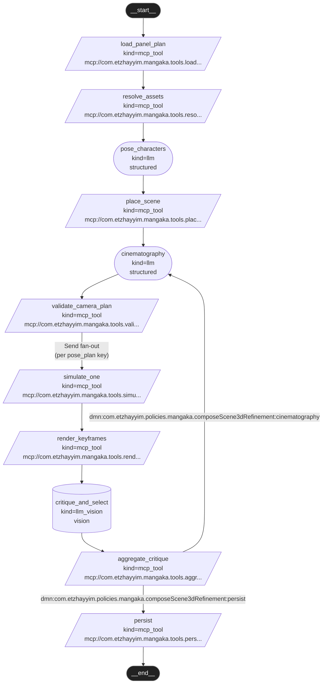

```mermaid
flowchart TD
    START([__start__]):::start
    load_panel_plan[/"load_panel_plan<br/>kind=mcp_tool<br/>mcp://com.etzhayyim.mangaka.tools.load..."/]
    resolve_assets[/"resolve_assets<br/>kind=mcp_tool<br/>mcp://com.etzhayyim.mangaka.tools.reso..."/]
    pose_characters(["pose_characters<br/>kind=llm<br/>structured"])
    place_scene[/"place_scene<br/>kind=mcp_tool<br/>mcp://com.etzhayyim.mangaka.tools.plac..."/]
    cinematography(["cinematography<br/>kind=llm<br/>structured"])
    validate_camera_plan[/"validate_camera_plan<br/>kind=mcp_tool<br/>mcp://com.etzhayyim.mangaka.tools.vali..."/]
    simulate_one[/"simulate_one<br/>kind=mcp_tool<br/>mcp://com.etzhayyim.mangaka.tools.simu..."/]
    render_keyframes[/"render_keyframes<br/>kind=mcp_tool<br/>mcp://com.etzhayyim.mangaka.tools.rend..."/]
    critique_and_select[("critique_and_select<br/>kind=llm_vision<br/>vision")]
    aggregate_critique[/"aggregate_critique<br/>kind=mcp_tool<br/>mcp://com.etzhayyim.mangaka.tools.aggr..."/]
    persist[/"persist<br/>kind=mcp_tool<br/>mcp://com.etzhayyim.mangaka.tools.pers..."/]
    END([__end__]):::start
    START --> load_panel_plan
    load_panel_plan --> resolve_assets
    resolve_assets --> pose_characters
    pose_characters --> place_scene
    place_scene --> cinematography
    cinematography --> validate_camera_plan
    simulate_one --> render_keyframes
    render_keyframes --> critique_and_select
    critique_and_select --> aggregate_critique
    persist --> END
    validate_camera_plan -- "Send fan-out<br/>(per pose_plan key)" --> simulate_one
    aggregate_critique -- "dmn:com.etzhayyim.policies.mangaka.composeScene3dRefinement:cinematography" --> cinematography
    aggregate_critique -- "dmn:com.etzhayyim.policies.mangaka.composeScene3dRefinement:persist" --> persist
    classDef start fill:#222,stroke:#888,color:#fff
```
