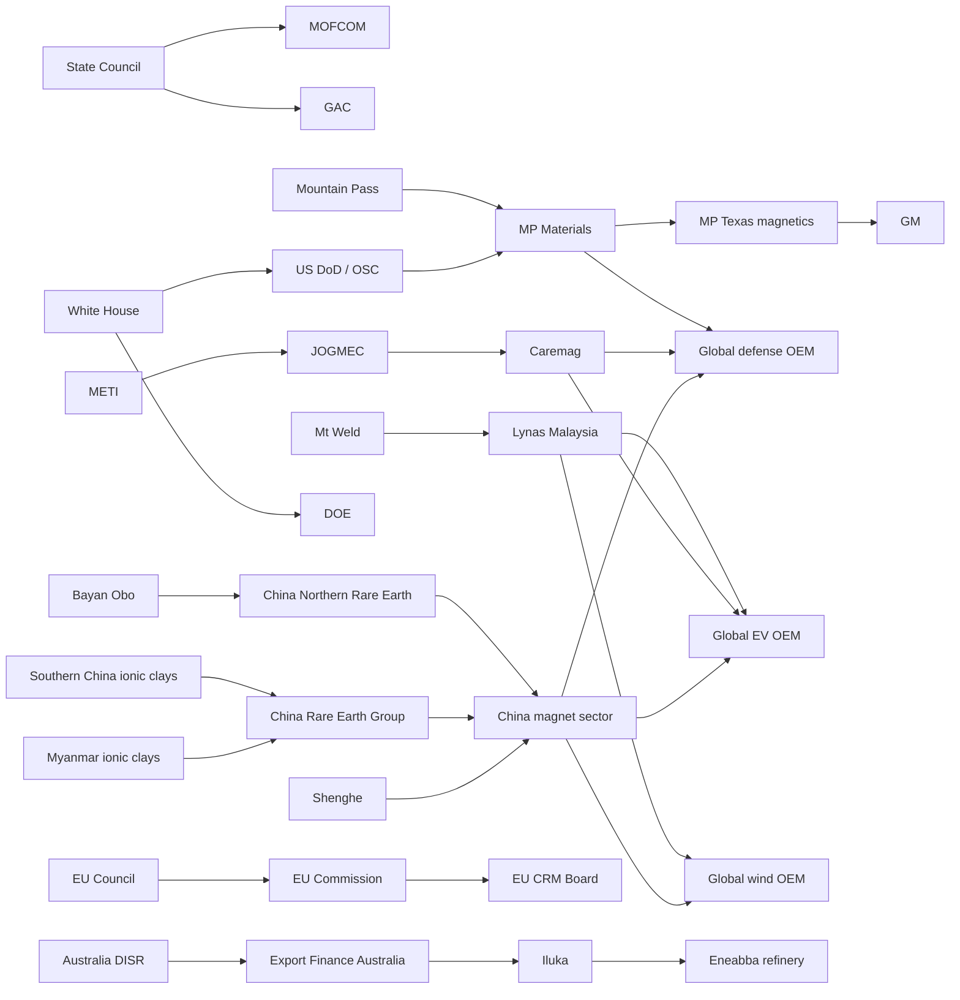

# Rare Earth Supply Chain Graph

- as of: `2026-04-13`
- data file: [rare-earth-supply-chain-2026-04-13.graph.json](/Users/junkawasaki/etzhayyim/etzhayyim-root/60-apps/etzhayyim-project-resource-flow/data/rare-earth-supply-chain-2026-04-13.graph.json)
- shape: `vertices[]` + `edges[]`
- vertex identity: every vertex has a `did`
- dependency encoding: every vertex has `deps[]` and the graph also has explicit `policy/resource_flow/capital_flow/offtake` edges

## Coverage

- upstream extraction: China north (`Bayan Obo`), China south ionic clays, Myanmar ionic clays, US (`Mountain Pass`), Australia (`Mt Weld`)
- midstream separation/refining: `China Northern Rare Earth`, `China Rare Earth Group`, `Shenghe`, `Lynas Malaysia`, `MP Materials`, `Eneabba`, `Caremag`
- downstream magnets/demand: China magnet sector, EV, wind, defense, GM
- regulation and finance: China `State Council / MOFCOM / GAC`, US `White House / DoD / DOE / USGS`, Australia `DISR / EFA`, EU `Council / Commission / CRM Board`, Japan `METI / JOGMEC`

## Mermaid

## Notes

- `active` means operating or currently in force.
- `planned` means publicly backed but not yet fully online.
- `confidence=medium` means the dependency is real but the exact commercial counterparty path is not fully public.
