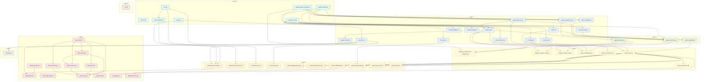

# Dependency Graph (all)

```mermaid
flowchart TD
  subgraph L0["Layer 0"]
    graph_schema["graph-schema [s]"]
    himuro["himuro [l]"]
    host_contract["host-contract [s]"]
    kagami_dialect_duckdb["kagami-dialect-duckdb [t]"]
    wit["wit [s]"]
    xrpc["xrpc [s,t]"]
    pulumi_core["pulumi-core [s]"]
  end
  subgraph L1["Layer 1"]
    graph_planner["graph-planner [t,q]"]
    kagami["kagami [t,q]"]
    kagami_client["kagami-client [q]"]
    query_codegen["query-codegen [t]"]
    query_pushdown["query-pushdown [t,q]"]
    vectorization["vectorization [t,q]"]
    wproto["wproto [e,t]"]
    cf_cache["cf-cache [q]"]
    cf_dns["cf-dns [r]"]
    cf_email["cf-email [e,r]"]
    cf_observability["cf-observability [e]"]
    cf_security["cf-security [r]"]
    linode_storage["linode-storage [l]"]
    kotoba_cluster["kotoba-cluster [l]"]
  end
  subgraph L2["Layer 2"]
    kagami_provider["kagami-provider [s]"]
    query_executor["query-executor [q]"]
    worker_kagami["worker-kagami [t,l]"]
  end
  subgraph L3["Layer 3"]
    kagami_provider_client_iceberg["kagami-provider-client-iceberg [q,e]"]
    kagami_provider_read["kagami-provider-read [q,e]"]
    kagami_provider_write["kagami-provider-write [l]"]
    query_coordinator["query-coordinator [q,r]"]
    worker_moderation["worker-moderation [t]"]
    worker_murakumo["worker-murakumo [t,r]"]
    worker_pds["worker-pds [r,q]"]
  end
  subgraph L4["Layer 4"]
    kotodama_host_sdk["kotodama-host-sdk [t,r]"]
    kotodama_kami_host["kotodama-kami-host [u,t]"]
    kotodama_rust["kotodama-rust [t]"]
    server_wproto["server-wproto [t]"]
    worker_briefing_signal["worker-briefing-signal [e]"]
    worker_browser_host["worker-browser-host [e]"]
    worker_dispatcher["worker-dispatcher [r]"]
    worker_email_relay["worker-email-relay [e]"]
    worker_git_server["worker-git-server [l]"]
    worker_relay["worker-relay [r]"]
  end
  subgraph L5["Layer 5"]
    appshellv2["appshellv2 [u,r]"]
    design_system["design-system [u]"]
    kami_content["kami-content [e,t]"]
    kami_core["kami-core [t]"]
    kami_engine_sdk["kami-engine-sdk [u]"]
    kami_entry["kami-entry [u]"]
    kami_game["kami-game [t]"]
    kami_network["kami-network [e,r]"]
    kami_render["kami-render [u]"]
    svelte_auth["svelte-auth [u]"]
    vite_plugin["vite-plugin [t]"]
    applications["applications [u,t,e]"]
  end
  subgraph L6["Layer 6"]
    cli["cli [t]"]
  end
  subgraph L7["Layer 7"]
    cluster["cluster [t,r]"]
  end

  design_system --> appshellv2
  wproto --> appshellv2
  kotodama_host_sdk --> appshellv2
  wproto --> cluster
  graph_schema --> graph_planner
  kagami_dialect_duckdb --> graph_planner
  wit --> host_contract
  kagami_dialect_duckdb --> kagami
  graph_schema --> kagami
  graph_planner --> kagami
  kagami --> kagami_client
  kagami --> kagami_provider
  kagami --> kagami_provider_client_iceberg
  kagami_provider --> kagami_provider_client_iceberg
  kagami_dialect_duckdb --> kagami_provider_client_iceberg
  kagami --> kagami_provider_read
  kagami_provider --> kagami_provider_read
  kagami --> kagami_provider_write
  kagami_provider --> kagami_provider_write
  kami_core --> kami_content
  kami_render --> kami_content
  kami_core --> kami_entry
  kami_render --> kami_entry
  kami_game --> kami_entry
  kami_content --> kami_entry
  kami_network --> kami_entry
  kami_core --> kami_game
  kami_core --> kami_network
  kami_core --> kami_render
  host_contract --> kotodama_host_sdk
  xrpc --> kotodama_host_sdk
  wproto --> kotodama_host_sdk
  wit --> kotodama_kami_host
  wit --> kotodama_rust
  graph_schema --> query_codegen
  kagami_dialect_duckdb --> query_codegen
  query_executor --> query_coordinator
  graph_planner --> query_coordinator
  vectorization --> query_coordinator
  graph_planner --> query_executor
  query_codegen --> query_executor
  query_pushdown --> query_executor
  graph_schema --> query_executor
  graph_schema --> query_pushdown
  kagami_dialect_duckdb --> query_pushdown
  wproto --> server_wproto
  graph_schema --> vectorization
  xrpc --> wproto
  worker_dispatcher --> applications
  worker_pds --> applications
  pulumi_core --> cf_cache
  pulumi_core --> cf_dns
  pulumi_core --> cf_email
  pulumi_core --> cf_observability
  pulumi_core --> cf_security
  pulumi_core --> linode_storage
  pulumi_core --> kotoba_cluster
  worker_pds --> worker_briefing_signal
  worker_pds --> worker_browser_host
  worker_pds --> worker_dispatcher
  worker_pds --> worker_email_relay
  cf_email --> worker_email_relay
  worker_pds --> worker_git_server
  kotoba_cluster --> worker_kagami
  cf_dns --> worker_kagami
  worker_pds --> worker_moderation
  cf_dns --> worker_murakumo
  worker_kagami --> worker_pds
  cf_security --> worker_pds
  cf_cache --> worker_pds
  worker_pds --> worker_relay

  style appshellv2 fill:#fce4ec,stroke:#c62828
  style cli fill:#f3e5f5,stroke:#6a1b9a
  style cluster fill:#eceff1,stroke:#546e7a
  style design_system fill:#fce4ec,stroke:#c62828
  style graph_planner fill:#e3f2fd,stroke:#1565c0
  style graph_schema fill:#e0f7fa,stroke:#00838f
  style himuro fill:#e0f7fa,stroke:#00838f
  style host_contract fill:#e0f7fa,stroke:#00838f
  style kagami fill:#e3f2fd,stroke:#1565c0
  style kagami_client fill:#e3f2fd,stroke:#1565c0
  style kagami_dialect_duckdb fill:#e0f7fa,stroke:#00838f
  style kagami_provider fill:#e8f5e9,stroke:#2e7d32
  style kagami_provider_client_iceberg fill:#fff8e1,stroke:#f9a825
  style kagami_provider_read fill:#fff8e1,stroke:#f9a825
  style kagami_provider_write fill:#fff8e1,stroke:#f9a825
  style kami_content fill:#fce4ec,stroke:#c62828
  style kami_core fill:#fce4ec,stroke:#c62828
  style kami_engine_sdk fill:#fce4ec,stroke:#c62828
  style kami_entry fill:#fce4ec,stroke:#c62828
  style kami_game fill:#fce4ec,stroke:#c62828
  style kami_network fill:#fce4ec,stroke:#c62828
  style kami_render fill:#fce4ec,stroke:#c62828
  style kotodama_host_sdk fill:#fff3e0,stroke:#ef6c00
  style kotodama_kami_host fill:#fff3e0,stroke:#ef6c00
  style kotodama_rust fill:#fff3e0,stroke:#ef6c00
  style query_codegen fill:#e3f2fd,stroke:#1565c0
  style query_coordinator fill:#fff8e1,stroke:#f9a825
  style query_executor fill:#e8f5e9,stroke:#2e7d32
  style query_pushdown fill:#e3f2fd,stroke:#1565c0
  style server_wproto fill:#fff3e0,stroke:#ef6c00
  style svelte_auth fill:#fce4ec,stroke:#c62828
  style vectorization fill:#e3f2fd,stroke:#1565c0
  style vite_plugin fill:#fce4ec,stroke:#c62828
  style wit fill:#e0f7fa,stroke:#00838f
  style wproto fill:#e3f2fd,stroke:#1565c0
  style xrpc fill:#e0f7fa,stroke:#00838f
  style applications fill:#fce4ec,stroke:#c62828
  style cf_cache fill:#e3f2fd,stroke:#1565c0
  style cf_dns fill:#e3f2fd,stroke:#1565c0
  style cf_email fill:#e3f2fd,stroke:#1565c0
  style cf_observability fill:#e3f2fd,stroke:#1565c0
  style cf_security fill:#e3f2fd,stroke:#1565c0
  style linode_storage fill:#e3f2fd,stroke:#1565c0
  style pulumi_core fill:#e0f7fa,stroke:#00838f
  style kotoba_cluster fill:#e3f2fd,stroke:#1565c0
  style worker_briefing_signal fill:#fff3e0,stroke:#ef6c00
  style worker_browser_host fill:#fff3e0,stroke:#ef6c00
  style worker_dispatcher fill:#fff3e0,stroke:#ef6c00
  style worker_email_relay fill:#fff3e0,stroke:#ef6c00
  style worker_git_server fill:#fff3e0,stroke:#ef6c00
  style worker_kagami fill:#e8f5e9,stroke:#2e7d32
  style worker_moderation fill:#fff8e1,stroke:#f9a825
  style worker_murakumo fill:#fff8e1,stroke:#f9a825
  style worker_pds fill:#fff8e1,stroke:#f9a825
  style worker_relay fill:#fff3e0,stroke:#ef6c00
```
