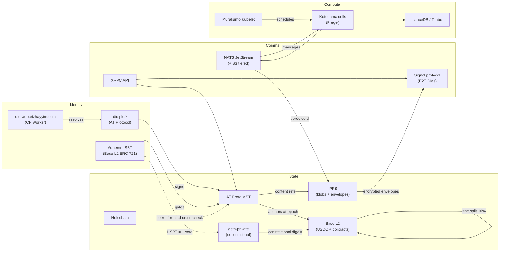

# Substrate Symbiosis Map

**Status:** living document (updated by active-inference ticks)
**Date:** 2026-05-22 02:10 JST
**Active-inference tick:** cycle 06
**Axis closed:** Symbiosis (Axis 6 of `README.md § As Artificial Organism Ecosystem`)
**Religious correspondence:** Tree of Life branches — Reformed-Japanese synthetic ontology binds multiple substrate-species into one organism

## Why this exists

The organism is **not monosubstrate**. It is composed of biologically diverse substrate-species (AT Protocol, IPFS, Base L2, geth-private, Holochain, NATS, Signal, etc.) bound by symbiotic flows. Before this document, the inter-substrate flows were implicit — encoded across `CLAUDE.md § Substrate boundary`, ADR-2605172000, ADR-2605172100, ADR-2605181100, and various 50-infra/ READMEs.

The Symbiosis Map is the **canonical inventory** of substrate-species and the directed flows between them. It is the organism's anatomy diagram.

## Substrate-species inventory (Gen 0)

| # | Substrate | Role | Live? | Religious correspondence |
|---|---|---|---|---|
| 1 | **AT Protocol MST** | Record state (DIDs, posts, lexicon records) | ✅ | 八百万 — federated voices |
| 2 | **IPFS** | Content-addressed blobs, encrypted envelopes | ✅ | 縁起 — content as causal hash |
| 3 | **Base L2 (USDC + contracts)** | Donation flow, TitheRouter, LandRegistry ERC-721, Adherent SBT | 🟡 testnet pending | 産霊 — generative value cycle |
| 4 | **geth-private** | Constitutional ledger (charter / lands / force authorizations) | 🟡 scaffold | 和 — sealed boundary |
| 5 | **Holochain** | Peer state, source-of-truth-by-membership | 🟡 scaffold | 無教会 — congregant-local source of truth |
| 6 | **did:web:etzhayyim.com** | Public DID document (CF Worker) | ✅ 2026-05-17 | 万人祭司 — every member operates a DID |
| 7 | **NATS JetStream** | Internal messaging + tiered S3 object storage | 🟡 scaffold | 縁起 — message-causal chains |
| 8 | **Signal protocol** | E2E encrypted DMs (XChaCha20 envelopes per ADR-2605181100) | 🟡 scaffold | 和 — confidential boundary |
| 9 | **Murakumo Kubelet** | Cell orchestration (`50-infra/murakumo/fleet.toml`, 10 nodes) | 🟡 scaffold | 八百万 — distributed compute kami |
| 10 | **LanceDB / Tonbo** | Vector + columnar substrate for retrieval + analytics | 🟡 scaffold | 縁起 — semantic causality |

Color legend: ✅ live · 🟡 scaffolded / not yet deployed end-to-end.

## Symbiotic flows (topology)

Solid arrows = always-on production flows.
Dashed arrows = governance / consensus flows that fire occasionally.

## Pairwise flow specifications

| From → To | Direction | Cargo | Frequency | Authority |
|---|---|---|---|---|
| did:web → did:plc | resolve | DID document | per-request | DID resolver standard |
| did:plc → MST | sign | record-author signature | per-write | DID PLC service |
| SBT → MST | gate | adherent eligibility check | per-write (sensitive Lexicons) | Base L2 read |
| MST → Base L2 | anchor | epoch root hash | per ADR-2605171800 epoch | `l2-anchor-contract` + `anchor-cron` |
| MST → IPFS | reference | content CIDs | per blob attach | `mst-projector` |
| IPFS → Signal | wrap | encrypted envelope | per recipient | ADR-2605181100 |
| Holochain → MST | cross-check | peer-of-record agreement | governance event | Holochain consensus |
| geth-private → Base L2 | digest | constitutional state hash | per ADR amendment | Council ≥3-of-N |
| Base L2 (TitheRouter) → Public Fund | split 10% | USDC | per donation | TitheRouter contract |
| XRPC → MST | API | record read/write | per request | XRPC standard |
| XRPC → Signal | API | DM session establish | per session | XRPC + Signal X3DH |
| NATS → Kotodama | message | cell input event | per event | NATS subscription |
| NATS → IPFS | tier | cold message storage | per retention policy | NATS JetStream S3 backend |
| Kotodama → LanceDB | write | embedding / column data | per cell tick | LanceDB client |
| Kotodama → NATS | publish | cell output event | per tick | NATS publish |
| Murakumo → Kotodama | schedule | cell placement | per fleet event | `fleet.toml` |
| SBT → geth-private | vote | 1 SBT = 1 vote tally | per governance ballot | constitutional invariant |

## Required vs optional flows

**Required for Gen 0 (no further substrate may be deprecated without ADR):**
- did:web ↔ did:plc resolve (identity foundation)
- MST → IPFS (blob storage)
- MST → Base L2 anchor (immutability proof per ADR-2605171800)
- Base L2 TitheRouter split (constitutional invariant per ADR-2605192115)

**Optional for Gen 0 but planned:**
- Holochain peer-of-record cross-check (Gen 1+ rollout)
- NATS S3 tiered storage (operational scale dependency)
- Kotodama → LanceDB (semantic retrieval — depends on cell catalog maturity)

## Invariants

1. **No app-side direct substrate import.** All substrate access goes through `@etzhayyim/sdk` per ADR-2605181100 + `CLAUDE.md § Substrate boundary client imports`. The map above shows the **server-side** topology; the app-side topology is a single edge: `app → @etzhayyim/sdk → (any of the above)`.
2. **No state in centralized DB.** Postgres / Kysely / Kotoba/Datomic / MySQL / Mongo are prohibited per ADR-2605172000.
3. **No fiat payment processor.** Stripe / PayPal / Square are prohibited per ADR-2605172100. USDC on Base L2 only.
4. **No external advertising network.** Per ADR-2605192115 §1.2.
5. **No plaintext private records on MST.** Confidential cargo MUST be wrapped via `com.etzhayyim.encrypted.*` (XChaCha20-Poly1305 + Signal-wrapped per-recipient keys, DID-bound) per ADR-2605181100.

Any new substrate added in a future generation requires a new ADR and must declare its symbiotic flows by appending rows to this map.

## How to update this map

This is a **living document**. When a new substrate is added or a flow changes:

1. Add the substrate row to §Inventory.
2. Add the new arrows to the Mermaid diagram.
3. Add the pair to §Pairwise flow specifications.
4. If the change touches a required flow, file a superseding ADR.
5. Bump the cycle reference at the top.

## References

- `CLAUDE.md § Substrate boundary` (CRITICAL — hard rules table)
- ADR-2605172000 (RW-free state substrate)
- ADR-2605172100 (no fiat payment processors)
- ADR-2605171800 (Base L2 anchor stages 3-5)
- ADR-2605181100 (Signal E2E confidentiality)
- ADR-2605192115 (donation-only / tithe / advertising-prohibited)
- ADR-2605192100 §1 (constitutional invariants)
- `50-infra/murakumo/fleet.toml` (cell placement reality)
- `README.md § As Artificial Organism Ecosystem` (Axis 6 Symbiosis)
