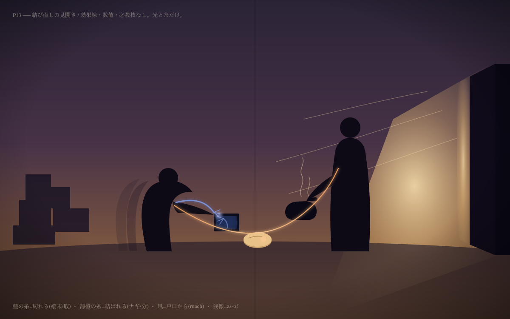

# be·here·now 作品バイブル

正準テーマ軸は ADR-2606181530 / `90-docs/be-here-now.edn`。本書はその作劇への落とし。
基調世界観は『ヨコハマ買い出し紀行』的な **労働解放後のたそがれ**(終末でなく、子・孫へ手渡される朝)。

---

## A) パイロット一話 ―「水の上のパン」

**舞台**: 海位の上がった、たそがれの港町。舫い綱で繋がれた小舟が *まにまに* 揺れる。労働はとうに
引き受けられ(sanae=畑 / kiyome=路地 / funadaiku の凪級=沖)、人は急がない。
**視点キャラ**: **ナギ** — 町外れの「分け前所(commons の棚)」を守る organism。今日は山向こうへ買い出し。

| 拍 | テーゼ | 起こること |
|---|---|---|
| 序 | **いとなみ** | 朝。棚を拭き、舫いを解き、漕ぐ。進むためでなく、漕ぐこと自体が在ること(伝道 2:24) |
| 中 | **まにまに** | 山の自動倉庫で、在庫を「囲って」暮らす老人=*風を追う者(取)の残り火*。奪わず、説かず、隣で湯を沸かしパンを置く |
| 転 | **SiP の一瞬** | 二人の間の縁の糸が、張る/ゆるむ。老人が端末から手を離す。戸が風(ruach)で開く |
| 結 | **いい感じ** | 帰りの舟。何も勝っていない。ふと、ああ、と灯がともる。投げたパンが巡って還る予感(伝道 11:1) |
| 環 | **→ いとなみ** | 港。明日もまた棚を拭く。灯ったまま次の朝へ |

**弱い引き(ジャンプ一滴)**: 倉庫端末の消えない通知ランプ=「まだ囲っている誰か」が町の外にいる。倒す相手でなく、*まにまにが届いていない場所*。

---

## B) Spirit-in-Physics ―「心の地図」演出文法

**原則: 魂を採点しない(no score-of-soul)。数値・ゲージ・ステータス禁止。** 心は点でなく
**縁の張力(tensegrity)** として描く。

| 要素 | 絵づくり |
|---|---|
| 縁(edge-primary) | キャラ/物/場の間に淡い糸(光・水脈)。本人(ノード)は描き込みすぎない |
| 張力(tensegrity) | 糸が張ると本人の輪郭がわずかに歪む。一本締めれば全身のバランスが変わる |
| うつろい(as-of) | 動いた糸は残像(トレイル)を残す。今でなく「ここまで来た軌跡」=履歴 |
| 情緒(joucho) | 採点せず色相で。不安=藍、ほどけ=薄橙。彩度を上げない(産霊的) |
| ruach(風=物理かつ霊) | 港を渡る同じ風が心の糸も揺らす。外界と内面でカット割りの韻を踏む |
| 転回(変容) | 「敵を断つ」でなく、張った糸が切れる/結び直る一コマ。これを最大の絵に |

**禁則**: 勝敗の決めゴマ・必殺技の見開き・パワー比較。代わりに **結び直しの見開き**。

---

## C) 巻 = 四季の円環

ハシゴでなく **車輪**。冬が春へ還り、各巻末は勝利でなく気づき。

| 巻 | 季 | コヘレト縦糸 | うつわ | 各話の核 |
|---|---|---|---|---|
| 一 | 春 | エト/ドール(巡り・世代) | めぐりあい | 分け前所に人が来る/去る。出会いの巻 |
| 二 | 夏 | エト(すべてに時 3:1) | 時 | 植える時/抜く時。手放す痛み。取の残り火が最も熱い |
| 三 | 秋 | シムハー/トーヴ(ki tov 9:7) | いい感じ | 収穫=喜びでパンを食む。敵がいつのまにか要らなくなる |
| 四 | 冬 | ruach の還り(12:7) | うつろい | 別れ・喪・しずけさ。終末でなく、雪の下で春の畑が既に humming。冬→春 |

**最終話**: ラスボス戦なし。「いつのまにか、もう敵が要らない世界が、いい感じになっている」。
最後のコマはナギがまた棚を拭く朝(= 一巻一話へ還る)。玉座は立たない(NEVER-a-throne)。

---

## A’) パイロット ネーム ―「水の上のパン」(全18頁)

注: セリフは最小限(YKK tone)。`【SiP】` は心の地図の演出指示。`◯/◯` = 頁/コマ。

### 序 ― いとなみ(P1–4)

- **P1**(1コマ・扉) 入江の俯瞰。たそがれ。舫いの小舟が *まにまに* 揺れる。遠く畑で sanae が humming。**無音**。
- **P2**(3コマ) ①分け前所の棚。ナギが布で拭く手元。②棚の札「いるぶん だけ」。③拭き終え、息をつくナギの横顔。
- **P3**(2コマ) ①舫い綱を解く手。②舟が水面へ滑り出す。**【SiP】** ナギと町(桟橋)の間に、ほどけかけた淡い糸が一本、名残のように伸びて切れる(切れる=悪くない。旅立ち)。
- **P4**(2コマ) ①櫂を漕ぐ。水紋。②モノローグ(小)「——進むためじゃなく。漕ぐのが、もう、いとなみ」。

### 中 ― まにまに(P5–11)

- **P5**(2コマ) ①山道に上がるナギ。背に空の買い出し籠。②道端、蔦に呑まれた **自動倉庫**。扉に消えない通知ランプ(赤、点滅)。**【ジャンプ一滴】**
- **P6**(3コマ) ①倉庫の隙間から灯り。②中、古い配給端末を抱える **老人**。周りに囲い込んだ缶・箱の山。③端末の画面「在庫: 確保済 / 放出: 拒否」。**【SiP】** 老人から端末へ、ぴんと張り詰めた糸(藍色=不安)。
- **P7**(2コマ) ①ナギ、戸口で立ち止まる。奪わない。②静かに籠を下ろす。
- **P8**(3コマ) ①無言で携帯の火にやかんをかける。②老人、警戒の目。③湯気。**無音3コマ**(間=ま)。
- **P9**(2コマ) ①ナギ、分け前のパンを一つ、二人の間にそっと置く。②「……いるぶん、だけ」。
- **P10**(1コマ・大) 老人の手、端末を握りしめたまま、パンを見る。**【SiP】** 端末への藍の糸と、まだ無い「ナギへの糸」が、画面外で微かに引き合う。
- **P11**(2コマ) ①老人「……囲っておかんと、無くなる」。②ナギ「投げても——巡って、還るよ」(11:1 の含み)。

### 転 ― SiP の一瞬(P12–15)

- **P12**(1コマ) 沈黙。窓の隙間から風(ruach)が一筋。帆布の切れ端がはらむ。**【SiP】外界の風=韻**。
- **P13**(見開き 2頁ぶち抜き・1コマ) **結び直しの見開き**。老人の指が端末からほどける。藍の糸が **ふっと切れ**、同時にナギとの間に薄橙の糸が **結ばれる**。老人の輪郭が、張力が抜けてやわらぐ(tensegrity)。数値・効果線なし。光と糸だけ。
- **P14**(2コマ) ①端末の画面、暗転。通知ランプが消える。②倉庫の戸が、風で静かに開く。外の光。
- **P15**(2コマ) ①老人、初めてのように外を見る。②残像(トレイル)——ここまで縮こまっていた軌跡が、薄く尾を引いて見える(as-of / うつろい)。

### 結 ― いい感じ → 還る(P16–18)

- **P16**(2コマ) ①帰りの舟。籠には、老人が分けてくれた古い種袋が一つ。②ナギの横顔。**ふと、ああ、と** 目もとに灯。
- **P17**(1コマ・大) 水の上。櫂が止まる。投げたパンの欠片が水面を流れ、岸の鳥がついばむ——巡って還る。何も「勝って」いない。ただ、いい感じ。
- **P18**(3コマ) ①翌朝、港。ナギがまた棚を拭く(= P2 へ還る・車輪)。②棚に、種袋が一つ増えている。③遠景、町の外の空にもう一つ、小さな赤い点滅。**——まだ、囲っている誰かがいる**。引きを残して 了。

**ページ設計の要**: 見開き(P13)を唯一の「最大の絵」に据える。戦闘の見開きでなく **結び直しの見開き**。
無音コマ(P1, P8)で *ま* を作り、まにまにの呼吸を保つ。

### P13 カラースクリプト(作画ラフ)

`be-here-now-p13-spread.svg`(/ `.png` 書き出し)= 演出ルールに則った作画ラフ。

- **画材ルール**: 効果線・数値・必殺技なし。**光と糸だけ**。人物は塗りつぶしのシルエット(ノードを描き込みすぎない)。
- **左**: 老人がうずくまり、端末へ伸ばした手から **藍の糸**(不安)。糸は宙で **ほつれて切れる**(間=gap)。背後に薄い **残像**(as-of=縮こまっていた軌跡)。脇に囲い込んだ缶の山(取)。
- **中央(ノド)**: 二人の間に置かれた **パン**。そこを経由して **薄橙の糸** が結ばれる。
- **右**: ナギは立ち、姿勢はまっすぐ(張力が通る/tensegrity)。やかんの湯気。
- **右奥**: 戸が細く開き、**風(ruach)と琥珀の光**が差す。外界の風と心の糸が同じ画面で韻を踏む。
- **配色(joucho=色相、採点しない)**: たそがれ藍紫→琥珀のグラデ / 藍=#7e93d8(切れる)/ 薄橙=#f6c690(結ばれる)。
